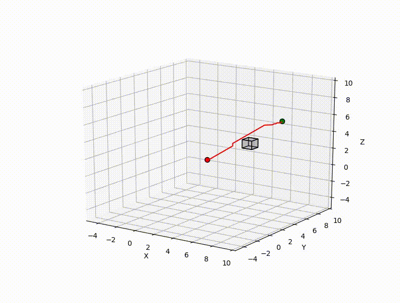
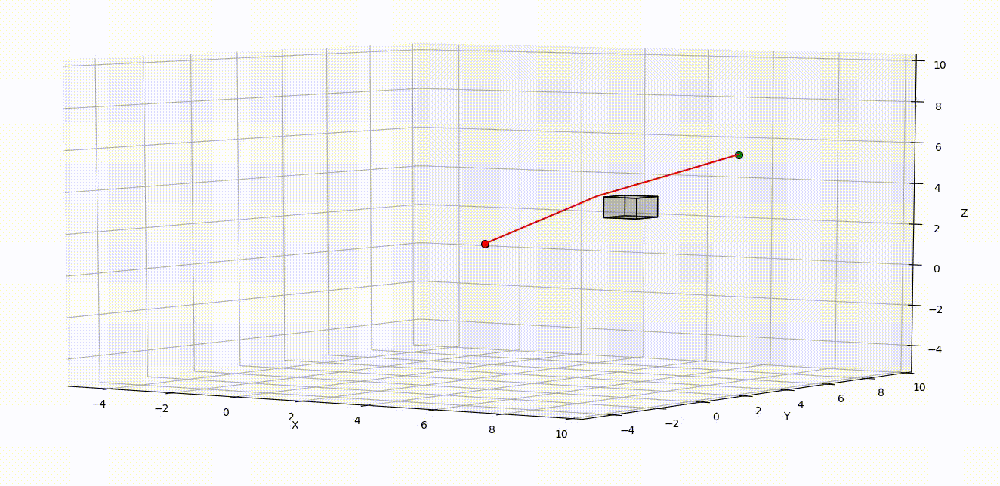

## Overview
Implemented and compared the performance of search-based and sampling-based motion planning algorithms on several 3-D environments.

## Technical Paper
* [Saurabh Himmatlal Mirani. "Path Planning" Aril 2020](report/PathPlanning_report.pdf)

### main.py:
This file contains examples of how to load and display the 7 environments and how to call a motion planner and plot the planned path.

#### Function description:

- **voxel_map()**: Takes in boundary, blocks and map resolution and converts into voxel map. returns a numpy array with 0 for free space and infinity for obstacles

- **get_grid_coord()**: Takes point in R^3 space and returns corresponding point in voxel_map space

- **visualize_3D()**: Isn't used for planning. Just to verify if the grid map corresponds to the actual given environment. Displays the voxels as points 

- **astar()**: Takes priority queue, which usually has just start node in it. empty parent nodes dictionary, g_matrix which is for maintaining cost from start. Initially initialzed to infinity for all except start node for which it is zero. And takes goal. It implements A* algorithm using neighbourhood search as helping function.
- **neighbourhood_search()**: Searches in 26 grid/voxels neighbourhood. Basically this implements all the things in while loop of the pseudocode as in report.
- **visualize_tree()**: is used to visualize tree at certain timestamps. Basically plots all the open nodes in priority queue. Is not used in planning
- **get_path()**: takes the parent nodes, goal, bounds and map resolution and converts into R^3 space path from voxel_map space path
- **cost_f()**: used to determine cost from point1 to point2
- **heuristic()**: used to compute heuristic  from given point to goal

#### Testing the code:
- Run the script by uncommenting the required test. Default uncommeted for test_single_cube().

### maps
This folder contains the 7 test environments described via a rectangular outer boundary and a list of rectangular obstacles. The start and goal points for each environment are specified in main.py.

### ompl_planner.py:

#### Function description:
- **ray_intersect_aabb()**: Function taken from pyrr and modified to avoid NaN error

- **class ValidityChecker()**: used to determine if state is valid. required for OMPL. returns true if valid else no.

- **class MyMotionValidator()**: used to determine if motion between state s1 and s2 is possible or not. returns true if yes else false

- **planner_ompl()**: sets all the required parameters, initializes the planner and solves the DSP.

#### Testing the code:
- Run the script by uncommenting the required test. Default uncommeted for test_flappy_bird().

All files expect maps in map folder.

## Results

### A* algorithm

  
  
  
  
  
  
  

### RRT algorithm

  
  
  
  
  
  
  

